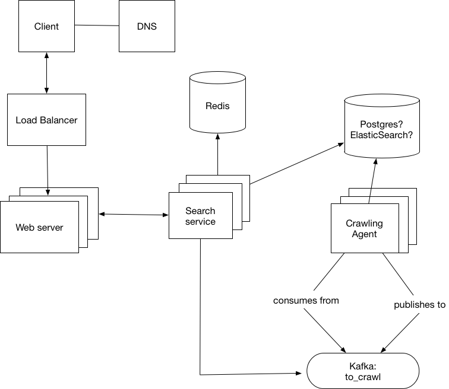

# spider

Web crawler implementation for Monzo

## First-time setup

```sh
yarn
yarn start
```

## Tasks

| Task         | Description                               |
|--------------|-------------------------------------------|
| start        | Starts the server and watches for changes |
| lint         | Lints the code using eslint               |
| test         | Runs the unit/integration tests           |
| test --watch | Runs the tests in watch mode              |


# Architecture overview

This is still a WIP and will change as the project evolve.


