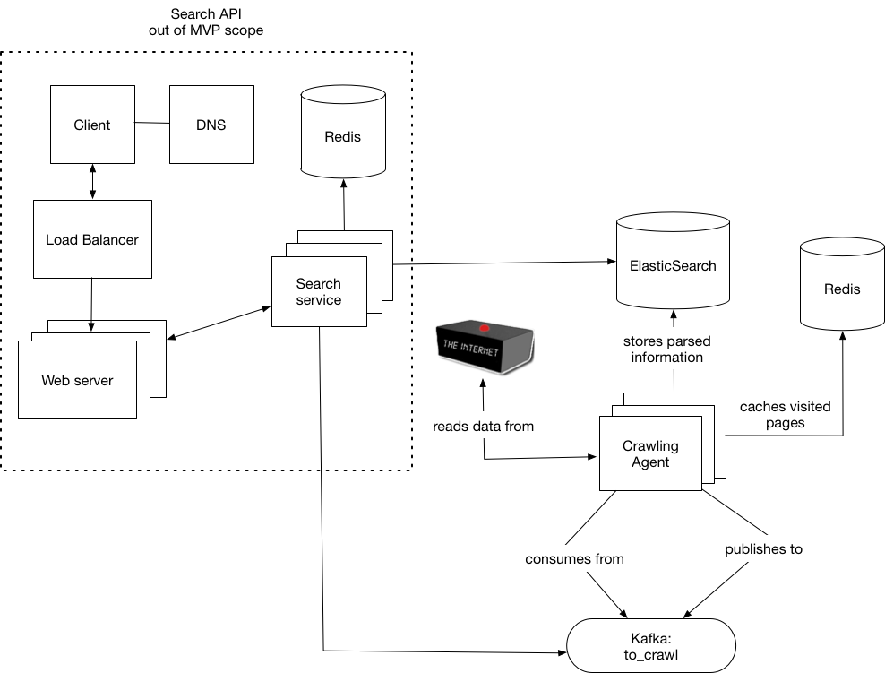

# 🕷️  Spider

Web crawler implementation for Monzo.

## First-time setup

```sh
# This will start kafka, elastic search and redis.
docker-compose up -d
yarn
yarn setup
yarn start
```

## Tasks

| Task         | Description                               |
|--------------|-------------------------------------------|
| start        | Starts the CLI                            |
| start:watch  | Starts the CLI and watches for changes    |
| db:reset     | Resets elastic search data/index to its initial state |
| lint         | Lints the code using eslint               |
| test         | Runs the unit/integration tests           |
| test --watch | Runs the tests in watch mode              |


# Architecture overview

This architecture diagram is still a WIP and is subject to change.



### Components

  - **Redis**: used for caching which pages have been visited
  - **ElasticSearch**: used to persist & index the crawled documents
  - **Kafka**: used as a message queue for distributing work (a.k.a pages that need to be crawled) between multiple consumers.
  - **Crawling agent**: performs HTTP requests to the target URL(s), parses the response and adds child links to a Kafka queue, so linked pages
  can also be crawled. Caches visited pages in Redis (in order speed things up and to prevent cycles) and index the parsed information in ElasticSearch.
  - **Search**: as of this moment is implemented as part of the crawling agent and can be invoked via CLI (refer to the demo above).


## Directory structure

```sh
.
├── config
├── docs
├── scripts # application scripts (e.g elastic search set-up)
└── src
    ├── config # general configuration files
    ├── crawler # where the crawler logic resides
    ├── lib
    │   ├── cache # interfaces for dealing with the "visited pages" cache
    │   ├── http # http client/interfaces
    │   ├── parser # parsers for each content type (currently only text/html) is supported
    │   └── queue # kafka consumer/producer logic
    ├── repository # persistence layer
    └── tasks # tasks executed when running the code via the CLI
```

## Known limitations

- Robots.txt is not (yet) being respected
- sitemap.xml is not being used
- Performance could be improved by ignoring files with unsupported media types
